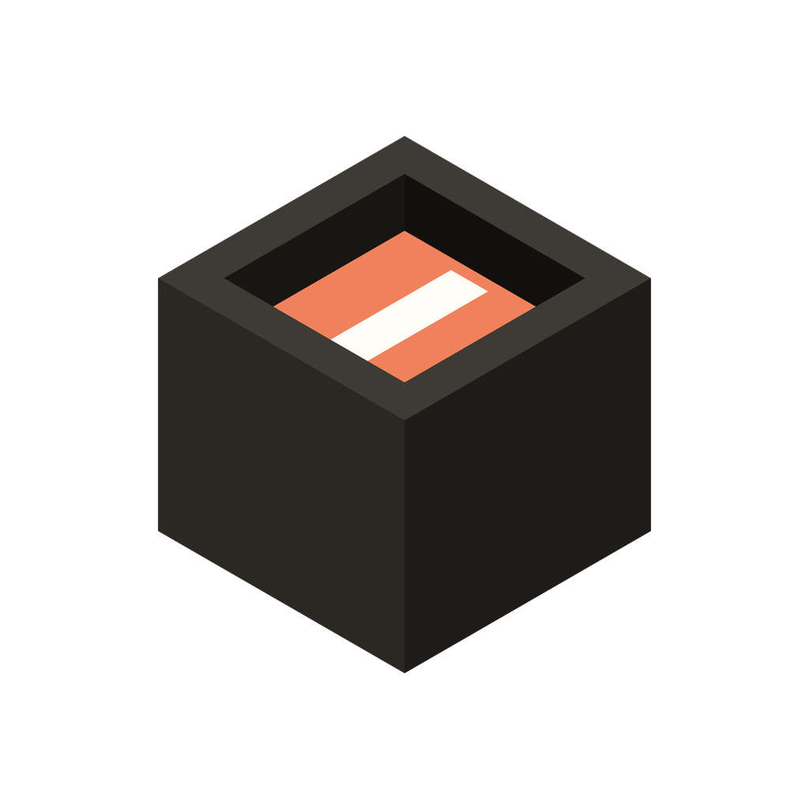
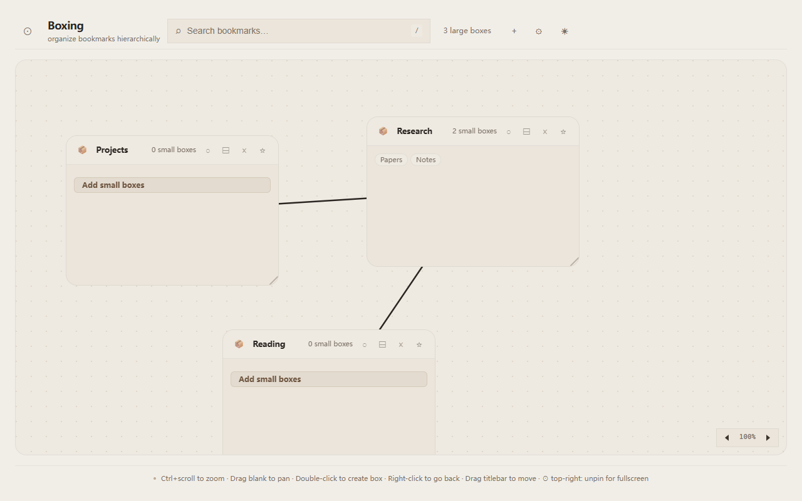
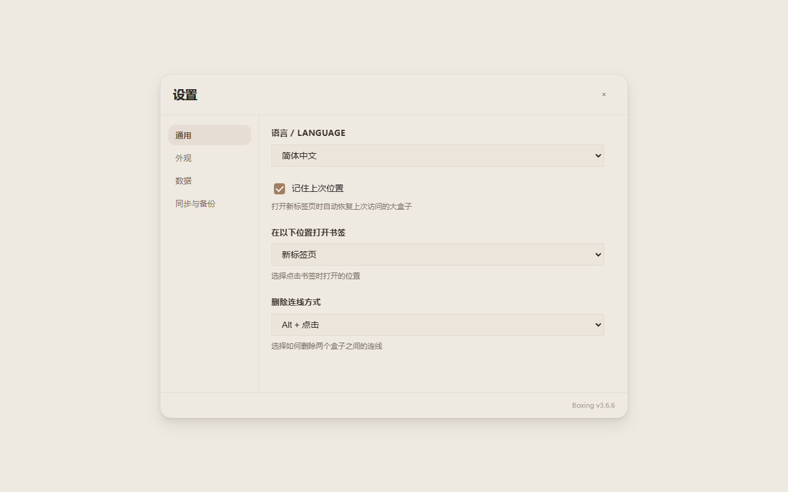
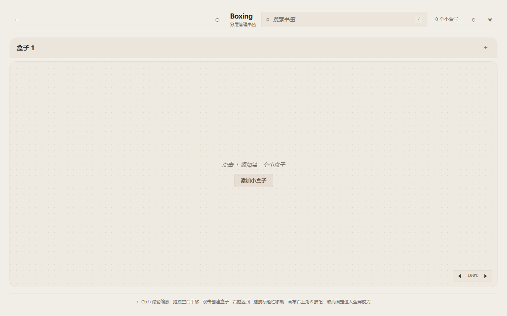

<!-- README-I18N:START -->
**Languages:** **English** · [简体中文](docs/i18n/README.zh_CN.md) · [繁體中文](docs/i18n/README.zh_TW.md) · [日本語](docs/i18n/README.ja.md) · [한국어](docs/i18n/README.ko.md) · [Français](docs/i18n/README.fr.md) · [Deutsch](docs/i18n/README.de.md) · [Español](docs/i18n/README.es.md) · [Português (Brasil)](docs/i18n/README.pt_BR.md) · [Русский](docs/i18n/README.ru.md) · [العربية](docs/i18n/README.ar.md) · [हिन्दी](docs/i18n/README.hi.md) · [ไทย](docs/i18n/README.th.md) · [Tiếng Việt](docs/i18n/README.vi.md) — see [TRANSLATIONS.md](TRANSLATIONS.md)
<!-- README-I18N:END -->

<div align="center">

<picture>
  <source media="(prefers-color-scheme: dark)" srcset="docs/brand/logo-dark-theme.png">
  <source media="(prefers-color-scheme: light)" srcset="docs/brand/logo-light-theme.png">
  
</picture>

# Boxing

**Your new tab is a spatial bookmark board.** Organize bookmarks into labeled boxes on an infinite, hierarchical canvas — drag, connect, and nest them spatially.

<p>
  <a href="#install">Install</a> ·
  <a href="#screenshots">Screenshots</a> ·
  <a href="#what-makes-it-different">Why</a> ·
  <a href="#usage">Usage</a> ·
  <a href="#privacy">Privacy</a> ·
  <a href="docs/store-publishing-plan.md">Store rollout</a>
</p>

<p>
  <a href="#install"></a>
  <a href="docs/publishing-guide.md"></a>
</p>

<p>
  <a href="docs/publishing-guide.md"></a>
  <a href="LICENSE"></a>
  
  
</p>

</div>

Think Obsidian canvas meets bookmarks.

**Proof — the new tab page, out of the box:**

<p align="center">
  
</p>

## What Makes It Different

**Infinite Canvas** — Pan and zoom freely (Ctrl+scroll). Create unlimited boxes on a single canvas. Connect boxes with lines to show relationships. Set parent-child relationships — move a parent and its children follow.

**Two-Level Hierarchy** — Large boxes hold small boxes. Small boxes hold bookmarks. Click into a box to enter its sub-canvas. Breadcrumb navigation shows your path. Nest as deep as needed.

**Bookmark Management** — Each box has its own bookmark collection with list and grid views. Add, edit, delete with a clean dialog. Open in current tab or new tab (configurable). Drag to reorder.

**Connectivity** — Visual SVG connection lines between boxes. Alt+Click a line to delete it (configurable: single-click or double-click). Parent-child movement propagation with elastic boundary clamping.

**Design & Theme** — Beige/cream minimalist aesthetic. Light and dark mode with automatic system detection. Adjustable font size and zoom. Square or rounded corners toggle.

**14 Languages** — en, zh_CN, zh_TW, ja, ko, fr, de, es, pt_BR, ru, ar, hi, th, vi with auto browser-language detection.

## Screenshots

| Canvas | Boxes & Bookmarks | Connections |
|--------|-------------------|-------------|
|  |  |  |

| Settings | Bookmark Editing |
|----------|------------------|
|  |  |

## Brand Assets

Light/dark logos, extension icons, favicons, store tiles, and the variants showcase are vendored in [`docs/brand/`](docs/brand/) (24 files, from the `box_png` asset kit). Reuse these for store listings, docs, and the GitHub social preview.

## Install

> [!IMPORTANT]
> **No installable packages are published yet.** GitHub Releases currently has zero releases,
> and no store listing is live: Edge Add-ons rollout is in progress, Chrome Web Store is
> deferred until Edge is live, and AMO has no public listing. Until the first release or
> listing ships, install from source below. Evidence: the
> [publication-surface verification report](.scratch/architecture-recovery/35-authoritative-publication-surface-verification-report.md);
> rollout and signing workflow: the [publishing guide](docs/publishing-guide.md).

### Chrome / Edge (Chromium)

1. Clone or download this repository
2. Install [Node.js](https://nodejs.org) >= 18, then run `npm install` followed by `npm run build` inside the repo folder
3. Go to `chrome://extensions` (or `edge://extensions`)
4. Enable **Developer mode** (top-right toggle)
5. Click **Load unpacked** and select the `dist/boxing-chrome/` folder

### Firefox

1. Clone or download this repository
2. Run `npm install` followed by `npm run build`
3. Go to `about:debugging#/runtime/this-firefox`
4. Click **Load Temporary Add-on...** and select `dist/boxing-firefox/manifest.json` (temporary add-ons are removed when Firefox restarts — expected for unsigned development installs)

> [!NOTE]
> **Signing status of build artifacts.** The build produces a `.zip` per browser for store
> upload; it is not signed by this repository. The `.crx` is self-signed only when a CRX3
> private key is configured in CI (`CRX_PRIVATE_KEY_PEM`); otherwise it is an unsigned local
> placeholder. The `.xpi` is an unsigned development build unless AMO API credentials are
> configured, in which case AMO signs it on the unlisted channel. Production signing is
> provided by the stores (Edge Add-ons) or AMO/web-ext at publish time — none of these
> artifacts are currently published for download.

> [!TIP]
> Until the first release or store listing is live, installing does need Node.js and npm once
> to run the build. End-user installs after that won't need them — see the
> [publishing guide](docs/publishing-guide.md).

## Usage

- **Double-click** empty canvas → create a new box
- **Drag** box title bar → move box
- **Ctrl+scroll** → zoom canvas (30% to 200%)
- **Drag** empty canvas → pan
- **Right-click** → go back to parent canvas level
- **Click** a box → enter its sub-canvas
- **Drag** from box edge midpoint → connect to another box
- **Alt+Click** a connection line → delete it
- **Star icon** on a box → mark as parent (children move together)
- **Pin icon** → lock box position
- **Canvas top-right circle button** → unpin header for fullscreen mode

## Privacy

- All data stored locally in `chrome.storage.local` — nothing leaves your device unless you configure optional cloud backup
- Optional WebDAV / GitHub Gist backup is the only outbound network usage
- No analytics, no tracking, no third-party services
- Full privacy policy: [docs/privacy-policy.md](docs/privacy-policy.md)

## Development

### Prerequisites

- Node.js >= 18
- npm

### Setup

```bash
git clone https://github.com/Xxx91n/boxing.git
cd boxing
npm install
npx playwright install firefox chromium
npm run build
```

### Build

```bash
npm run build     # Dev build → dist/boxing-chrome + dist/boxing-firefox
npm run dev:chrome   # Build + launch Chrome with extension loaded (web-ext)
npm run dev:firefox  # Build + launch Firefox with extension loaded (web-ext)
npm run dev:chrome:no-build   # Fast reload without rebuilding (requires prior build)
npm run dev:firefox:no-build  # Fast reload without rebuilding (requires prior build)
npm test          # Playwright tests (Chrome + Firefox)
```

See [CONTRIBUTING.md](CONTRIBUTING.md) for the full development guide.

## Quarantined tests

The quarantine program is **converged as of 2026-09-05** (ticket 27): no test titles carry the
`@quarantine` tag anymore. The final 14 entries were repaired by converting their native-input
dispatch to synthetic events (the established repair pattern — the guarded behavior is
app-level, not input realness) and rejoined the Firefox main lane; the only native-input block
kept (double-click selection realness in `boxing-focus-steal.spec.ts`) is chromium-scoped
because native input on the Firefox persistent context stalls (the
[playwright#16095](https://github.com/microsoft/playwright/issues/16095) class). The history:
tags were introduced in architecture-recovery ticket 01, governed since ticket 14, first five
entries repaired at the ticket 18 expiry pass
([.scratch/architecture-recovery/18-quarantine-expiry-report.md](.scratch/architecture-recovery/18-quarantine-expiry-report.md)),
final 14 at ticket 27
([.scratch/architecture-recovery/27-firefox-quarantine-convergence-report.md](.scratch/architecture-recovery/27-firefox-quarantine-convergence-report.md)).

| Test (spec › title) | Chromium | Firefox | Registered | Due (30d) |
| --- | --- | --- | --- | --- |
| *(none — quarantine table empty since ticket 27, 2026-09-05)* | — | — | — | — |

Baseline at convergence: chromium 14/14 and firefox 14/14 pass in the quarantine lane
(2026-09-05, ticket 27); after the tag removal the firefox main lane absorbed all 14 tests and
`npm run test:quarantine` selects 0 tests (exit 0 via `--pass-with-no-tests`).

**Expiry rule.** Every entry must be resolved by its due date — either **repaired** (remove the
`@quarantine` tag + `quarantine-ref` comment, rejoin the Firefox lane, delete the row) or
**retired** (delete the test and the row, recording the decision in the governance ticket).
Entries do **not** auto-extend: at expiry the next governance pass forces the decision, defaulting
to retirement. A newly tagged quarantine must be registered in this table the same day, with
due = registered + 30 days. The quarantine lane is patrolled daily by CI
(`.github/workflows/quarantine.yml`, `continue-on-error`).

### Host-environment incident register

Tests that failed from host-load browser instability — not app defects — are registered here
with a CI re-verification due date instead of a `@quarantine` tag: they pass and stay in every
lane, and the repair-or-retire default of tagged quarantine does not fit a host incident.
Classification protocol and evidence: ticket 31
([.scratch/architecture-recovery/31-state-sync-flaky-diagnosis-report.md](.scratch/architecture-recovery/31-state-sync-flaky-diagnosis-report.md)).

| Test (spec › title) | Incident | Classification | Registered | Due (30d) |
| --- | --- | --- | --- | --- |
| boxing-state-sync.spec.ts › two tabs synchronize creation and protect a view whose large box is deleted | 2026-09-05 host-load; chromium CDP session closed mid-test; same-day green in ticket 27 full run; runtime identical by git diff | environment-only | 2026-09-06 | 2026-10-06 |
| boxing-state-sync.spec.ts › concurrent creation in two tabs converges without losing either box | same incident | environment-only | 2026-09-06 | 2026-10-06 |
| boxing-state-sync.spec.ts › concurrent small-box creation converges and persists the merged children | same incident | environment-only | 2026-09-06 | 2026-10-06 |

Incident-row rule: a row is resolved (deleted) once a CI run after the lockfile repair (ticket 29)
shows its test green in the chromium lane. Rows do not auto-extend: past due without CI-green
evidence, the next governance pass must reclassify — defect repair or tagged quarantine.

## Contributing

Contributions are welcome! See [CONTRIBUTING.md](CONTRIBUTING.md) for setup, workflow, and code style.

## License

Apache-2.0 — see [LICENSE](LICENSE)
