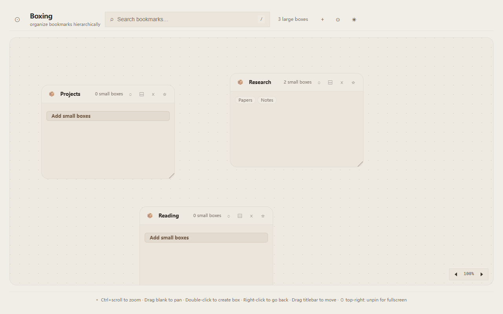
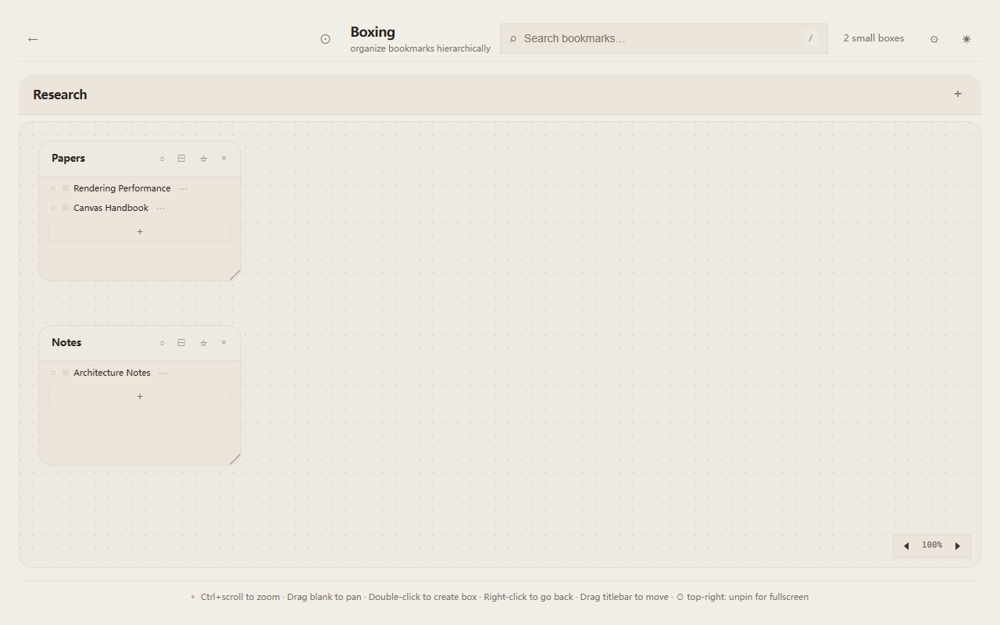

<!-- README-I18N:START -->
**Languages:** [English](../../README.md) · [简体中文](README.zh_CN.md) · [繁體中文](README.zh_TW.md) · [日本語](README.ja.md) · **한국어** · [Français](README.fr.md) · [Deutsch](README.de.md) · [Español](README.es.md) · [Português (Brasil)](README.pt_BR.md) · [Русский](README.ru.md) · [العربية](README.ar.md) · [हिन्दी](README.hi.md) · [ไทย](README.th.md) · [Tiếng Việt](README.vi.md)
<!-- README-I18N:END -->

# Boxing

계층형 무한 캔버스 북마크 오거나이저. 베이지 미니멀리스트 디자인.

Boxing은 브라우저 새 탭 페이지를 시각적 북마크 워크스페이스로 변환합니다. 평면 폴더 대신 무한 캔버스에 라벨이 있는 박스로 북마크를 정리하세요 — 드래그, 연결, 중첩하여 당신의 사고 방식대로 공간에 배치합니다. Obsidian 캔버스와 북마크가 만났다고 생각하시면 됩니다.

<picture>
  <source media="(prefers-color-scheme: dark)" srcset="../../docs/store-assets/screenshots/screenshot-1-canvas.png">
  
</picture>

> [!NOTE]
> 이것은 자리 표시자입니다. 메인 캔버스의 박스와 연결을 보여주는 실제 스크린샷으로 교체하세요.

## 목차

- [기능](#features)
- [설치](#install)
- [**더블 클릭** 빈 캔버스 → 새 박스 생성,**드래그** 박스 제목 표시줄 → 박스 이동,**Ctrl+스크롤** → 캔버스 줌 (30% ~ 200%),**드래그** 빈 캔버스 → 팬,**우클릭** → 상위 캔버스로 돌아가기,**클릭** 박스 → 하위 캔버스 진입,박스 가장자리 중점에서 **드래그** → 다른 박스에 연결,**Alt+클릭** 연결선 → 삭제,박스의 **별표** → 부모 박스로 표시 (자식이 함께 이동),**핀** → 박스 위치 잠금,캔버스 우측 상단 **원형 버튼** → 헤더 고정 해제, 전체 화면 모드](#usage)
- [모든 데이터는 `chrome.storage.local`에 로컬 저장 — 옵션 클라우드 백업을 설정하지 않는 한 기기를 떠나지 않습니다,옵션 WebDAV / GitHub Gist 백업이 유일한 아웃바운드 네트워크 사용입니다,분석 없음, 추적 없음, 제3자 서비스 없음,100% 오픈 소스 (Apache-2.0) — 모든 코드를 감사할 수 있습니다,전체 개인정보 처리방침: [docs/privacy-policy.md](../../docs/privacy-policy.md)](#privacy)
- [개발](#development)
- [기여](#contributing)
- [라이선스](#license)

## 기능

**무한 캔버스** — 자유롭게 팬 및 줌 (Ctrl+스크롤). 단일 캔버스에 무제한 박스 생성. 선으로 연결하여 관계 표시. 부모-자식 관계 설정 — 부모 박스를 이동하면 자식도 따라 이동.

**2단계 계층** — 큰 박스 안에 작은 박스, 작은 박스 안에 북마크. 박스를 클릭하여 하위 캔버스 진입. 이동 경로 표시. 필요한 만큼 깊이 중첩 가능.

**북마크 관리** — 각 박스마다 고유한 북마크 컬렉션 (리스트 & 그리드 보기). 추가, 편집, 삭제를 깔끔한 대화상자로. 현재 탭 또는 새 탭에서 열기 (설정 가능). 드래그로 재정렬.

**연결** — 박스 간 시각적 SVG 연결선. Alt+클릭으로 선 삭제 (설정 가능: 단일 클릭 또는 더블 클릭). 부모-자식 이동 전파, 탄성 경계 클램프 포함.

**디자인 & 테마** — 베이지/크림 미니멀 미학. 라이트/다크 모드, 시스템 자동 감지. 글꼴 크기 및 줌 조절 가능. 모서리 각/둥글기 전환.

**14개 언어** — en, zh_CN, zh_TW, ja, ko, fr, de, es, pt_BR, ru, ar, hi, th, vi, 브라우저 언어 자동 감지.

<picture>
  <source media="(prefers-color-scheme: dark)" srcset="../../docs/store-assets/screenshots/screenshot-2-boxes.png">
  
</picture>

> [!NOTE]
> 이것은 자리 표시자입니다. 박스 계층과 북마크 관리를 보여주는 실제 스크린샷으로 교체하세요.

## 설치

### Chrome / Edge (Chromium)

1. 최신 [릴리스 ZIP](https://github.com/Xxx91n/boxing/releases) 다운로드
2. 폴더에 압축 해제
3. `chrome://extensions` (또는 `edge://extensions`)로 이동
4. 우측 상단 **개발자 모드** 활성화
5. **압축 해제된 확장 프로그램 로드** 클릭 후 압축 해제된 폴더 선택

### Firefox

1. 최신 [릴리스 XPI](https://github.com/Xxx91n/boxing/releases) 다운로드
2. `about:addons`로 이동
3. 톱니바퀴 아이콘 → **파일에서 부가 기능 설치**
4. 다운로드한 XPI 파일 선택

> [!TIP]
> 일반 사용자는 Node.js나 npm이 필요하지 않습니다. 개발용으로만 사용됩니다.

## **더블 클릭** 빈 캔버스 → 새 박스 생성,**드래그** 박스 제목 표시줄 → 박스 이동,**Ctrl+스크롤** → 캔버스 줌 (30% ~ 200%),**드래그** 빈 캔버스 → 팬,**우클릭** → 상위 캔버스로 돌아가기,**클릭** 박스 → 하위 캔버스 진입,박스 가장자리 중점에서 **드래그** → 다른 박스에 연결,**Alt+클릭** 연결선 → 삭제,박스의 **별표** → 부모 박스로 표시 (자식이 함께 이동),**핀** → 박스 위치 잠금,캔버스 우측 상단 **원형 버튼** → 헤더 고정 해제, 전체 화면 모드

- **더블 클릭** 빈 캔버스 → 새 박스 생성
- **드래그** 박스 제목 표시줄 → 박스 이동
- **Ctrl+스크롤** → 캔버스 줌 (30% ~ 200%)
- **드래그** 빈 캔버스 → 팬
- **우클릭** → 상위 캔버스로 돌아가기
- **클릭** 박스 → 하위 캔버스 진입
- 박스 가장자리 중점에서 **드래그** → 다른 박스에 연결
- **Alt+클릭** 연결선 → 삭제
- 박스의 **별표** → 부모 박스로 표시 (자식이 함께 이동)
- **핀** → 박스 위치 잠금
- 캔버스 우측 상단 **원형 버튼** → 헤더 고정 해제, 전체 화면 모드

## 모든 데이터는 `chrome.storage.local`에 로컬 저장 — 옵션 클라우드 백업을 설정하지 않는 한 기기를 떠나지 않습니다,옵션 WebDAV / GitHub Gist 백업이 유일한 아웃바운드 네트워크 사용입니다,분석 없음, 추적 없음, 제3자 서비스 없음,100% 오픈 소스 (Apache-2.0) — 모든 코드를 감사할 수 있습니다,전체 개인정보 처리방침: [docs/privacy-policy.md](../../docs/privacy-policy.md)

- 모든 데이터는 `chrome.storage.local`에 로컬 저장 — 옵션 클라우드 백업을 설정하지 않는 한 기기를 떠나지 않습니다
- 옵션 WebDAV / GitHub Gist 백업이 유일한 아웃바운드 네트워크 사용입니다
- 분석 없음, 추적 없음, 제3자 서비스 없음
- 100% 오픈 소스 (Apache-2.0) — 모든 코드를 감사할 수 있습니다
- 전체 개인정보 처리방침: [docs/privacy-policy.md](../../docs/privacy-policy.md)

## 개발

### 필수 조건

- Node.js >= 18
- npm

### 설정

```bash
git clone https://github.com/Xxx91n/boxing.git
cd boxing
npm install
npx playwright install firefox chromium
npm run build
```

### 빌드

```bash
npm run build     # 개발 빌드 → dist/boxing-chrome + dist/boxing-firefox
npm test          # Playwright 테스트 (Chrome + Firefox)
```

전체 개발 가이드는 [CONTRIBUTING.md](../../CONTRIBUTING.md)를 참조하세요.

## 기여

기여를 환영합니다! 설정, 워크플로우 및 코드 스타일은 [CONTRIBUTING.md](../../CONTRIBUTING.md)를 참조하세요.

## 라이선스

Apache-2.0 — [LICENSE](../../LICENSE) 참조

<!-- README-I18N:START:FOOTER -->
> Translations: [English](../../README.md) · [简体中文](README.zh_CN.md) · [繁體中文](README.zh_TW.md) · [日本語](README.ja.md) · [Français](README.fr.md) · [Deutsch](README.de.md) · [Español](README.es.md) · [Português (Brasil)](README.pt_BR.md) · [Русский](README.ru.md) · [العربية](README.ar.md) · [हिन्दी](README.hi.md) · [ไทย](README.th.md) · [Tiếng Việt](README.vi.md) — see [TRANSLATIONS.md](../../TRANSLATIONS.md)
<!-- README-I18N:END:FOOTER -->
